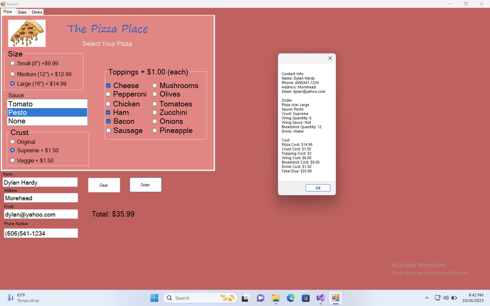

# Pizza Delivery Windows App (.NET)

A C# Windows Forms desktop application for managing pizza ordering. Project to demonstrate Windows app development skills using the .NET framework.

---

## 🚀 Features
- Create pizza orders
- Calculates total price
- Clean and intuitive Windows Forms UI

---

## 🛠 Tech Stack
- **Language:** C#
- **Framework:** .NET (Windows Forms)

---

## 📷 Screenshot



---

## 🧪 Getting Started

### Prerequisites
- Visual Studio (2019 or later)
- .NET Framework installed

### Run the App
1. Clone the repository:
   ```bash
   git clone https://github.com/Dylan7893/C-Sharp-Dot-Net-Pizza-Delivery-Windows-App.git
